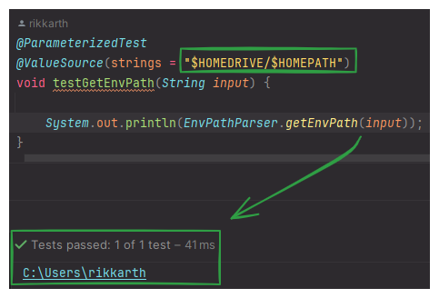

# Tooler-Tools

Tooler-Tools: A versatile Java library for backend and CLI developers, offering a growing collection of tools to
simplify your development tasks.

## Easy Integration

[Sonatype Maven Central Repository][Sonatype Maven Central Repository Link]

[GitHub Packages][GitHub Packages Link]

[Sonatype Maven Central Repository Link]: https://central.sonatype.com/artifact/pt.codeforge/tooler-tools

[GitHub Packages Link]: https://github.com/rikkarth/tooler-tools/packages/2005257

## Installation

```
<dependency>
  <groupId>pt.codeforge</groupId>
  <artifactId>tooler-tools</artifactId>
  <version>${version}</version>
</dependency>
```

## Tools

**XmlHandler** retrieves values from a doc when provided with the target XPath.

**EnvPathParser** parses and expands env path variables into file paths.



### Example - Get String From XPath

```
String pages = getStringFromXPath("/root/path/to/element", doc);
```

#### Possible outcomes:

1. `pages` is never null;
2. `pages` can be empty if value can't be found;
3. `pages` will return value.

```
String pages = getStringFromXPath("/root/path/to/various-elements/text()", doc) // Returns First Element;
String pages = getStringFromXPath("/root/path/to/various-elements[1]/text()", doc) // Returns First Element;
String pages = getStringFromXPath("/root/path/to/various-elements[2]/text()", doc) // Returns Second Element;
String pages = getStringFromXPath("/root/path/to/various-elements[3]/text()", doc) // Returns Third Element;
```

### Example - Get NodeList From XPath
```
NodeList elements = getStringFromXPath("/root/path/to/various-elements", doc);

elements.getLength() // returns 0 if nothing found, and 'n' if something found.
```

